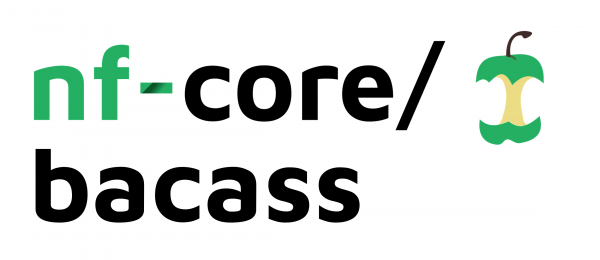

# 

[](https://github.com/nf-core/bacass/actions?query=workflow%3A%22nf-core+CI%22)
[](https://github.com/nf-core/bacass/actions?query=workflow%3A%22nf-core+linting%22)
[](https://nf-co.re/bacass/results)
[](https://doi.org/10.5281/zenodo.2669428)

[](https://www.nextflow.io/)
[](https://docs.conda.io/en/latest/)
[](https://www.docker.com/)
[](https://sylabs.io/docs/)

[](https://nfcore.slack.com/channels/bacass)
[](https://twitter.com/nf_core)
[](https://www.youtube.com/c/nf-core)

## Introduction

**nf-core/bacass** is a bioinformatics best-practice analysis pipeline for simple bacterial assembly and annotation. The pipeline is able to assemble short reads, long reads, or a mixture of short and long reads (hybrid assembly).

The pipeline is built using [Nextflow](https://www.nextflow.io), a workflow tool to run tasks across multiple compute infrastructures in a very portable manner. It uses Docker/Singularity containers making installation trivial and results highly reproducible. The [Nextflow DSL2](https://www.nextflow.io/docs/latest/dsl2.html) implementation of this pipeline uses one container per process which makes it much easier to maintain and update software dependencies. Where possible, these processes have been submitted to and installed from [nf-core/modules](https://github.com/nf-core/modules) in order to make them available to all nf-core pipelines, and to everyone within the Nextflow community!

<!-- TODO nf-core: Add full-sized test dataset and amend the paragraph below if applicable -->
<!-- On release, automated continuous integration tests run the pipeline on a full-sized dataset on the AWS cloud infrastructure. This ensures that the pipeline runs on AWS, has sensible resource allocation defaults set to run on real-world datasets, and permits the persistent storage of results to benchmark between pipeline releases and other analysis sources. The results obtained from the full-sized test can be viewed on the [nf-core website](https://nf-co.re/bacass/results). -->

## Pipeline summary

### Short Read Assembly

This pipeline is primarily for bacterial assembly of next-generation sequencing reads. It can be used to quality trim your reads using [Skewer](https://github.com/relipmoc/skewer) and performs basic sequencing QC using [FastQC](https://www.bioinformatics.babraham.ac.uk/projects/fastqc/). Afterwards, the pipeline performs read assembly using [Unicycler](https://github.com/rrwick/Unicycler). Contamination of the assembly is checked using [Kraken2](https://ccb.jhu.edu/software/kraken2/) to verify sample purity.

### Long Read Assembly

For users that only have Nanopore data, the pipeline quality trims these using [PoreChop](https://github.com/rrwick/Porechop) and assesses basic sequencing QC utilizing [NanoPlot](https://github.com/wdecoster/NanoPlot) and [PycoQC](https://github.com/a-slide/pycoQC).
The pipeline can then perform long read assembly utilizing [Unicycler](https://github.com/rrwick/Unicycler), [Miniasm](https://github.com/lh3/miniasm) in combination with [Racon](https://github.com/isovic/racon), or [Canu](https://github.com/marbl/canu). Long reads assembly can be polished using [Medaka](https://github.com/nanoporetech/medaka) or [NanoPolish](https://github.com/jts/nanopolish) with Fast5 files.

### Hybrid Assembly

For users specifying both short read and long read (NanoPore) data, the pipeline can perform a hybrid assembly approach utilizing [Unicycler](https://github.com/rrwick/Unicycler), taking the full set of information from short reads and long reads into account.

### Assembly QC and annotation

In all cases, the assembly is assessed using [QUAST](http://bioinf.spbau.ru/quast). The resulting bacterial assembly is furthermore annotated using [Prokka](https://github.com/tseemann/prokka) or [DFAST](https://github.com/nigyta/dfast_core).

## Quick Start

1. Install [`Nextflow`](https://www.nextflow.io/docs/latest/getstarted.html#installation) (`>=21.04.0`)

2. Install any of [`Docker`](https://docs.docker.com/engine/installation/), [`Singularity`](https://www.sylabs.io/guides/3.0/user-guide/), [`Podman`](https://podman.io/), [`Shifter`](https://nersc.gitlab.io/development/shifter/how-to-use/) or [`Charliecloud`](https://hpc.github.io/charliecloud/) for full pipeline reproducibility _(please only use [`Conda`](https://conda.io/miniconda.html) as a last resort; see [docs](https://nf-co.re/usage/configuration#basic-configuration-profiles))_

3. Download the pipeline and test it on a minimal dataset with a single command:

    ```console
    nextflow run nf-core/bacass -profile test,<docker/singularity/podman/shifter/charliecloud/conda/institute>
    ```

    > * Please check [nf-core/configs](https://github.com/nf-core/configs#documentation) to see if a custom config file to run nf-core pipelines already exists for your Institute. If so, you can simply use `-profile <institute>` in your command. This will enable either `docker` or `singularity` and set the appropriate execution settings for your local compute environment.
    > * If you are using `singularity` then the pipeline will auto-detect this and attempt to download the Singularity images directly as opposed to performing a conversion from Docker images. If you are persistently observing issues downloading Singularity images directly due to timeout or network issues then please use the `--singularity_pull_docker_container` parameter to pull and convert the Docker image instead. Alternatively, it is highly recommended to use the [`nf-core download`](https://nf-co.re/tools/#downloading-pipelines-for-offline-use) command to pre-download all of the required containers before running the pipeline and to set the [`NXF_SINGULARITY_CACHEDIR` or `singularity.cacheDir`](https://www.nextflow.io/docs/latest/singularity.html?#singularity-docker-hub) Nextflow options to be able to store and re-use the images from a central location for future pipeline runs.
    > * If you are using `conda`, it is highly recommended to use the [`NXF_CONDA_CACHEDIR` or `conda.cacheDir`](https://www.nextflow.io/docs/latest/conda.html) settings to store the environments in a central location for future pipeline runs.

4. Start running your own analysis!

    Default: Short read assembly with Unicycler, `--kraken2db` can be any [compressed database (`.tar.gz`/`.tgz`)](https://benlangmead.github.io/aws-indexes/k2):

    ```console
    nextflow run nf-core/bacass -profile <docker/singularity/podman/shifter/charliecloud/conda/institute> --input samplesheet.tsv --kraken2db "https://genome-idx.s3.amazonaws.com/kraken/k2_standard_8gb_20210517.tar.gz"
    ```

    Long read assembly with Miniasm:

    ```console
    nextflow run nf-core/bacass -profile <docker/singularity/podman/shifter/charliecloud/conda/institute> --input samplesheet.tsv --assembly_type 'long' --assembler 'miniasm' --kraken2db "https://genome-idx.s3.amazonaws.com/kraken/k2_standard_8gb_20210517.tar.gz"
    ```

## Documentation

The nf-core/bacass pipeline comes with documentation about the pipeline [usage](https://nf-co.re/bacass/usage), [parameters](https://nf-co.re/bacass/parameters) and [output](https://nf-co.re/bacass/output).

## Credits

nf-core/bacass was originally written by Andreas Wilm, Alexander Peltzer.

We thank the following people for their extensive assistance in the development of this pipeline:

* Daniel Straub ([@d4straub](https://github.com/d4straub))

## Contributions and Support

If you would like to contribute to this pipeline, please see the [contributing guidelines](.github/CONTRIBUTING.md).

For further information or help, don't hesitate to get in touch on the [Slack `#bacass` channel](https://nfcore.slack.com/channels/bacass) (you can join with [this invite](https://nf-co.re/join/slack)).

## Citations

If you use  nf-core/bacass for your analysis, please cite it using the following doi: [10.5281/zenodo.2669428](https://doi.org/10.5281/zenodo.2669428)

An extensive list of references for the tools used by the pipeline can be found in the [`CITATIONS.md`](CITATIONS.md) file.

You can cite the `nf-core` publication as follows:

> **The nf-core framework for community-curated bioinformatics pipelines.**
>
> Philip Ewels, Alexander Peltzer, Sven Fillinger, Harshil Patel, Johannes Alneberg, Andreas Wilm, Maxime Ulysse Garcia, Paolo Di Tommaso & Sven Nahnsen.
>
> _Nat Biotechnol._ 2020 Feb 13. doi: [10.1038/s41587-020-0439-x](https://dx.doi.org/10.1038/s41587-020-0439-x).
