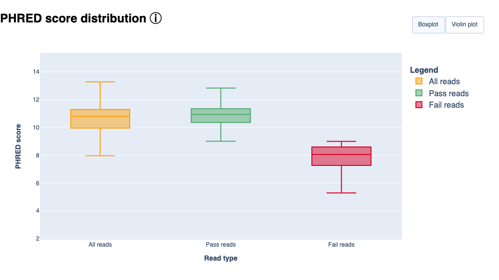

# nf-core/bacass: Output

## Introduction

This document describes the output produced by the pipeline. Most of the plots are taken from the MultiQC report, which summarises results at the end of the pipeline.

The directories listed below will be created in the results directory after the pipeline has finished. All paths are relative to the top-level results directory.

## Pipeline overview

The pipeline is built using [Nextflow](https://www.nextflow.io/) and processes data using the following steps:

- [Quality trimming and QC](#quality-trimming-and-qc)
  - [Short Read Trimming](#short-read-trimming)
  - [Short Read RAW QC](#short-read-raw-qc)
  - [Long Read Trimming](#long-read-trimming)
  - [Long Read RAW QC](#long-read-raw-qc)
- [Taxonomic classification](#taxonomic-classification)
- [Assembly Output](#assembly-output)
  - [Polished assemblies](#polished-assemblies)
- [Assembly QC with QUAST and BUSCO](#assembly-qc-with-quast-and-busco)
- [Annotation](#annotation)
- [Report](#report)
- [Pipeline information](#pipeline-information) - Report metrics generated during the workflow execution

## Quality trimming and QC

### Short Read Trimming

This step quality trims the end of reads, removes degenerate or too short reads and if needed,
combines reads coming from multiple sequencing runs.

Output files

- `trimming/shortreads/`
  - `*.fastp.fastq.gz`: The trimmed/modified/unmerged fastq reads

### Short Read RAW QC

[FastQC](http://www.bioinformatics.babraham.ac.uk/projects/fastqc/) gives general quality metrics about your sequenced reads. It provides information about the quality score distribution across your reads, per base sequence content (%A/T/G/C), adapter contamination and overrepresented sequences. For further reading and documentation see the [FastQC help pages](http://www.bioinformatics.babraham.ac.uk/projects/fastqc/Help/).

> [!NOTE]
> The FastQC plots displayed in the MultiQC report shows _untrimmed_ reads. They may contain adapter sequence and potentially regions with low quality.

Output files

- `FastQC/`
  - `*.html`: FastQC report containing quality metrics.
  - `*.zip`: Zip archive containing the FastQC report, tab-delimited data file and plot images.

### Long Read Trimming

This step performs long read trimming on Nanopore input (if provided) using [PoreChop](https://github.com/rrwick/Porechop) or filtering using [Filtlong](https://github.com/rrwick/Filtlong).

Output files

- `trimming/longreads/porechop`
  - `*.fastq.gz`: The trimmed FASTQ file
  - `*.log*`: Log file

- `trimming/longreads/filtlong`
  - `*.fastq.gz`: The trimmed FASTQ file
  - `*.log*`: Log file

### Long Read RAW QC

These steps perform long read QC for input data (if provided).

Please refer to the documentation of [NanoPlot](https://github.com/wdecoster/NanoPlot), [PycoQC](https://a-slide.github.io/pycoQC/) and [ToulligQC](https://github.com/GenomiqueENS/toulligQC) if you want to know more about the plots created by these tools.

Output files

- `QC_Longreads/NanoPlot`: Various plots in HTML and PNG format

- `QC_Longreads/PycoQC`
  - `*_pycoqc.html`: QC report in HTML format
  - `*_pycoqc.json`: QC report in JSON format

- QC_Longreads/ToulligQC
  - `*/report.html`: QC report in HTML format

Example plot from Nanoplot:

Example plot from ToulligQC:

Example

## Taxonomic classification

This QC step classifies your reads using [Kraken2](https://ccb.jhu.edu/software/kraken2/) a k-mer based approach. This helps to identify samples that have purity
issues. Ideally you will not want to assemble reads from samples that are contaminated or contain
multiple species. If you like to visualize the report, try
[Pavian](https://github.com/fbreitwieser/pavian) or [Krakey](http://krakey.info/).

Output files

- `Kraken2/`
  - `*.kraken2.report.txt`: Classification of short reads in the Kraken(1) report format.
  - `*_longreads.kraken2.report.txt`: Classification of long reads in the Kraken(1) report format.

See [webpage](http://ccb.jhu.edu/software/kraken/MANUAL.html#sample-reports) for more details.

Exemplary Kraken2 report screenshot:

## Reads QC and Sample purity

The pipeline includes a dedicated step for short and long reads QC as well as contamination analysis using [Kmerfinder](https://bitbucket.org/genomicepidemiology/kmerfinder/src/master/). This process helps assess the quality and purity of the samples.

Output files

- `Kmerfinder/{ID}/`
  - `*_results.txt`: Kmerfinder report table containing reads QC results and taxonomic information.
- `Kmerfinder/`
  - `kmerfinder_summary.csv`: A CSV file containing the most relevant results of all samples analyzed with Kmerfinder.

## Assembly Output

Trimmed reads are assembled with [Unicycler](https://github.com/rrwick/Unicycler) in `short` or `hybrid` assembly modes. For long-read assembly, there are also `canu` and `miniasm` available.
Unicycler is a pipeline on its own, which at least for Illumina reads mainly acts as a frontend to Spades with added polishing steps.

Output files

- `Unicycler/`
  - `*.scaffolds.fa`: Final assembly in fasta format
  - `*.assembly.gfa`: Final assembly in Graphical Fragment Assembly (GFA) format
  - `*.unicycler.log`: Log file summarizing steps and intermediate results on the Unicycler execution

Check out the [Unicycler documentation](https://github.com/rrwick/Unicycler) for more information on Unicycler output.

- `Canu/`
  - `*.contigs.fasta.gz`: Final assembly in fasta format
  - `*.report`: Log file summarizing steps and intermediate results

Check out the [Canu documentation](https://canu.readthedocs.io/en/latest/index.html) for more information on Canu output.

- `Miniasm/`
  - `*.fasta.gz`: Assembly in Fasta format
  - `*_assembly_consensus.fasta.gz`: Consensus assembly in fasta format (polished by Racon)

Check out the [Miniasm documentation](https://github.com/lh3/miniasm) for more information on Miniasm output.

- `Dragonflye/`
  - `*.contigs.fa`: Assembly in Fasta format
  - `*.dragonflye.log`: Log file containing the report of the dragonflye process

Checkout the [Dragonflye](https://github.com/rpetit3/dragonflye) documentation for more information of the Dragonflye output.

### Polished assemblies

Long reads assemblies can be polished using [Medaka](https://github.com/nanoporetech/medaka) or [NanoPolish](https://github.com/jts/nanopolish) with Fast5 files.

Output files

- `Medaka/*_polished_genome.fa`
  - `*_polished_genome.fa`: Polished consensus assembly in fasta format
  - `calls_to_draft.bam`: Alignment in bam format
  - `calls_to_draft.bam.bai`: Index of alignment
  - `consensus.fasta.gaps_in_draft_coords.bed`
  - `consensus_probs.hdf`

- `Nanopolish/`
  - `polished_genome.fa`: Polished consensus assembly in fasta format

## Assembly QC with QUAST and BUSCO

The assembly QC is performed with [QUAST](http://quast.sourceforge.net/quast) for all assemblies in one report. It reports multiple metrics including number of contigs, N50, lengths etc in form of an html report. It further creates an HTML file with integrated contig viewer (Icarus).
It also runs [BUSCO](https://busco.ezlab.org/), a software which assess genome quality based on the presence of lineage-specific single-copy orthologs

Output files

- `QUAST/report/`
  - `icarus.html`: QUAST's contig browser as HTML
  - `report.html`: QUAST assembly QC as HTML report
  - `report.pdf`: QUAST assembly QC as pdf
  - `icarus.html`: QUAST's contig browser as HTML
  - `report.html`: QUAST assembly QC as HTML report
  - `report.pdf`: QUAST assembly QC as pdf
- `busco/`: BUSCO reports
  - `<SampleName>_<stage>-<BuscoLineage>-busco/`: BUSCO output folder, please refer to BUSCO documentation for details.
  - `<SampleName>_<stage>-<BuscoLineage>-busco.batch_summary.txt`: BUSCO batch summary output
  - `short_summary.specific.<SampleName>_<stage>.{txt,json}`: BUSCO short summaries in txt and json format

## Annotation

By default, the assembly is annotated with [Prokka](https://github.com/tseemann/prokka) which acts as frontend for several annotation tools and includes rRNA and ORF predictions. Alternatively, on request, the assembly is annotated with [Bakta](https://github.com/oschwengers/bakta), [DFAST](https://github.com/nigyta/dfast_core) or [LIFTOFF](https://github.com/agshumate/Liftoff).

Output files

- `Prokka/{ID}/`
  - `*.gff`: Annotation in gff format
  - `*.txt`: Annotation in text format
  - `*.faa`: Protein sequences in fasta format

See [Prokka's documentation](https://github.com/tseemann/prokka#output-files) for a full description of all output files.

- `Bakta/{ID}/`
  - `*.gff3`: Annotations in gff3 format
  - `*.txt`: Summary in txt format
  - `*.faa`: CDS/sORF amino acid sequences in fasta format

See [Baktas's documentation](https://github.com/oschwengers/bakta#output) for a full description of all output files.

- `DFAST/{ID}_results/`
  - `genome.gff`: Annotation in gff format
  - `statistics.txt`: Annotation statistics in text format
  - `protein.faa`: Protein sequences in fasta format

- `LIFTOFF/`
  - `{ID}.gff3`: Annotation in gff format
  - `{ID}.polished.gff3`: Polished lifted annotations in gff format
  - `{ID}.unmapped.txt`: Unmapped reference annotations

See [LIFTOFF's documentation](https://github.com/agshumate/Liftoff#output) for a full description of all output files.

## Report

Some pipeline results are visualised by [MultiQC](http://multiqc.info), which is a visualisation tool that generates a single HTML report summarising all samples in your project. Further statistics are available in within the report data directory.

[MultiQC](http://multiqc.info) is a visualization tool that generates a single HTML report summarising all samples in your project. Most of the pipeline QC results are visualised in the report and further statistics are available in the report data directory.

The pipeline has special steps which also allow the software versions to be reported in the MultiQC output for future traceability.

Results generated by MultiQC collate pipeline QC from supported tools e.g. FastQC. The pipeline has special steps which also allow the software versions to be reported in the MultiQC output for future traceability. For more information about how to use MultiQC reports, see <http://multiqc.info>.

Output files

- `multiqc/`
  - `multiqc_report.html`: a standalone HTML file that can be viewed in your web browser.
  - `multiqc_data/`: directory containing parsed statistics from the different tools used in the pipeline.
  - `multiqc_plots/`: directory containing static images from the report in various formats.
  - `summary_assembly_metrics_mqc.csv`: custom table containing most relevant assembly QC metrics.

### Pipeline information

[Nextflow](https://www.nextflow.io/docs/latest/tracing.html) provides excellent functionality for generating various reports relevant to the running and execution of the pipeline. This will allow you to troubleshoot errors with the running of the pipeline, and also provide you with other information such as launch commands, run times and resource usage.

Output files

- `pipeline_info/`
  - Reports generated by Nextflow: `execution_report.html`, `execution_timeline.html`, `execution_trace.txt` and `pipeline_dag.dot`/`pipeline_dag.svg`.
  - Reports generated by the pipeline: `pipeline_report.html`, `pipeline_report.txt` and `software_versions.yml`. The `pipeline_report*` files will only be present if the `--email` / `--email_on_fail` parameter's are used when running the pipeline.
  - Reformatted samplesheet files used as input to the pipeline: `samplesheet.valid.csv`.
  - Parameters used by the pipeline run: `params.json`.

