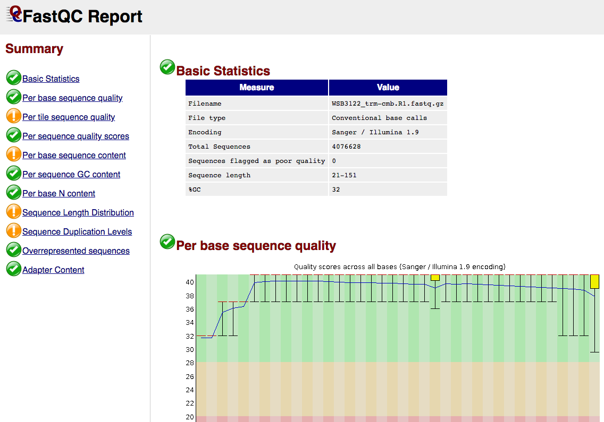
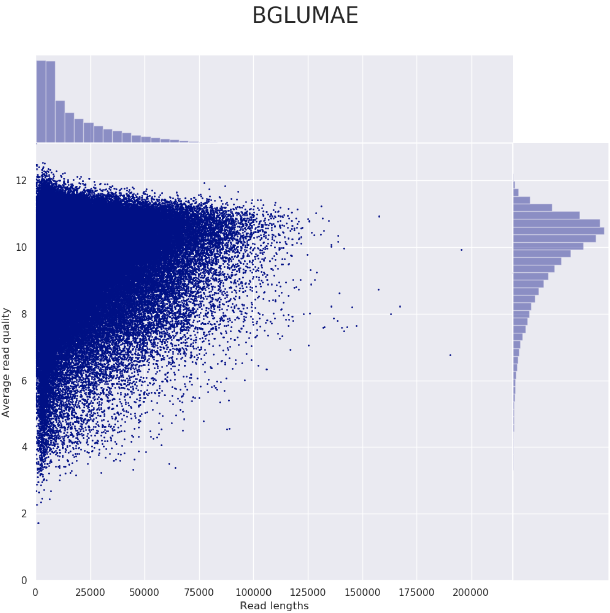
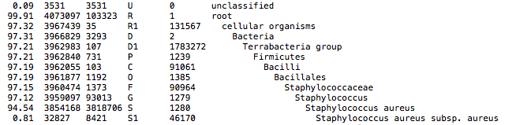
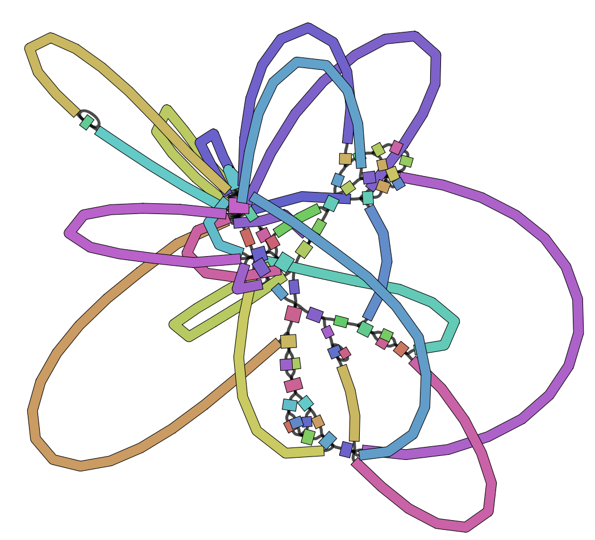
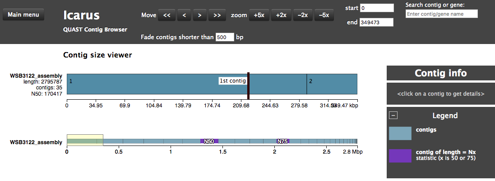
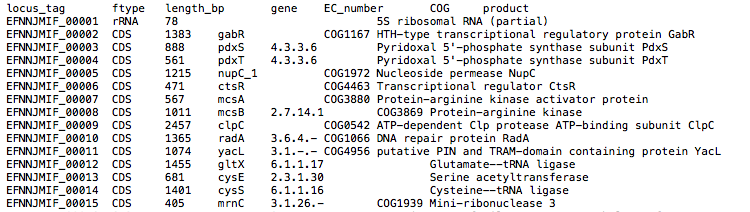

# nf-core/bacass: Output

## :warning: Please read this documentation on the nf-core website: [https://nf-co.re/bacass/output](https://nf-co.re/bacass/output)

> _Documentation of pipeline parameters is generated automatically from the pipeline schema and can no longer be found in markdown files._

## Introduction

This document describes the output produced by the pipeline. Most of the plots are taken from the MultiQC report, which summarises results at the end of the pipeline.

## Pipeline overview

The pipeline is built using [Nextflow](https://www.nextflow.io/)
and processes data using the following steps:

* [nf-core/bacass: Output](#nf-corebacass-output)
  * [Pipeline overview](#pipeline-overview)
  * [Quality trimming and QC](#quality-trimming-and-qc)
    * [Short Read Trimming](#short-read-trimming)
    * [Short Read RAW QC](#short-read-raw-qc)
    * [Long Read Trimming](#long-read-trimming)
    * [Long Read RAW QC](#long-read-raw-qc)
  * [Taxonomic classification](#taxonomic-classification)
    * [Kraken2 report screenshot](#kraken2-report-screenshot)
  * [Assembly Output](#assembly-output)
  * [Assembly Visualization with Bandage](#assembly-visualization-with-bandage)
  * [Assembly QC with QUAST](#assembly-qc-with-quast)
  * [Annotation with Prokka](#annotation-with-prokka)
  * [Report](#report)
  * [Pipeline information](#pipeline-information)

## Quality trimming and QC

### Short Read Trimming

This step quality trims the end of reads, removes degenerate or too short reads and if needed,
combines reads coming from multiple sequencing runs.

**Output directory: `{sample_id}/trimming/shortreads/`**

* `*.fastq.gz`
  * trimmed (and combined reads)

### Short Read RAW QC

This step runs FastQC which produces
general quality metrics on your (trimmed) samples and plots them.

**Output directory: `{sample_id}/trimming/shortreads/`**

* `*_fastqc.html`
  * FastQC report, containing quality metrics for your trimmed reads
* `*_fastqc.zip`
  * zip file containing the FastQC report, tab-delimited data file and plot images

For further reading and documentation see the [FastQC help](http://www.bioinformatics.babraham.ac.uk/projects/fastqc/Help/).

### Long Read Trimming

This step performs long read trimming on Nanopore input (if provided).

**Output directory: `{sample_id}/trimming/longreads/`**

* `trimmed.fastq`
  * The trimmed FASTQ file

### Long Read RAW QC

These steps perform long read QC for input data (if provided).

**Output directory: `{sample_id}/QC_Longreads/`**

* `NanoPlot`
* `PycoQC`

Please refer to the documentation of [NanoPlot](https://github.com/wdecoster/NanoPlot) and [PycoQC](https://a-slide.github.io/pycoQC/) if you want to know more about the plots created by these tools.

Example plot from Nanoplot:

## Taxonomic classification

This QC step classifies your reads using [Kraken2](https://ccb.jhu.edu/software/kraken2/) a k-mer based approach. This helps to identify samples that have purity
issues. Ideally you will not want to assemble reads from samples that are contaminated or contain
multiple species. If you like to visualize the report, try
[Pavian](https://github.com/fbreitwieser/pavian) or [Krakey](http://krakey.info/).

**Output directory: `{sample}/`**

* `*_kraken2.report`
  * Classification in the Kraken(1) report format. See
    [webpage](http://ccb.jhu.edu/software/kraken/MANUAL.html#sample-reports) for more details

### Kraken2 report screenshot

## Assembly Output

Trimmed reads are assembled with [Unicycler](https://github.com/rrwick/Unicycler) in `short` or `hybrid` assembly modes. For long-read assembly, there are also `canu` and `miniasm` available.
Unicycler is a pipeline on its own, which at least for Illumina reads mainly acts as a frontend to Spades with added polishing steps.

**Output directory: `{sample_id}/unicycler`**

* `{sample}_assembly.fasta`
  * Final assembly
* `{sample}_assembly.gfa`
  * Final assembly in Graphical Fragment Assembly (GFA) format
* `{sample}_unicycler.log`
  * Log file summarizing steps and intermediate results on the Unicycler execution

Check out the [Unicycler documentation](https://github.com/rrwick/Unicycler) for more information on Unicycler output.

**Output directory: `{sample_id}/canu`**

Check out the [Canu documentation](https://canu.readthedocs.io/en/latest/index.html) for more information on Canu output.

**Output directory: `{sample_id}/miniasm`**

* `consensus`
  * The consensus sequence created by `miniasm`

Check out the [Miniasm documentation](https://github.com/lh3/miniasm) for more information on Miniasm output.

## Assembly Visualization with Bandage

The GFA file produced in the assembly step with Unicycler can be used to visualise the assembly graph, which is
done here with [Bandage](https://rrwick.github.io/Bandage/). We highly recommend to run the Bandage GUI for more versatile visualisation options (annotations etc).

**Output directory: `{sample_id}/unicycler`**

* `{sample}_assembly.png`
  * Bandage visualization of assembly

## Assembly QC with QUAST

The assembly QC is performed with [QUAST](http://quast.sourceforge.net/quast).
It reports multiple metrics including number of contigs, N50, lengths etc in form of an html report.
It further creates an HTML file with integrated contig viewer (Icarus).

**Output directory: `{sample_id}/QUAST`**

* `icarus.html`
  * QUAST's contig browser as HTML
* `report.html`
  * QUAST assembly QC as HTML report

## Annotation with Prokka

The assembly is annotated with [Prokka](https://github.com/tseemann/prokka) which acts as frontend
for several annotation tools and includes rRNA and ORF predictions. See [its documentation](https://github.com/tseemann/prokka#output-files) for a full description of all output files.

**Output directory: `{sample_id}/{sample_id}_annotation`**

## Report

Some pipeline results are visualised by [MultiQC](http://multiqc.info), which is a visualisation tool that generates a single HTML report summarising all samples in your project. Further statistics are available in within the report data directory.

[MultiQC](http://multiqc.info) is a visualization tool that generates a single HTML report summarizing all samples in your project. Most of the pipeline QC results are visualised in the report and further statistics are available in the report data directory.

The pipeline has special steps which also allow the software versions to be reported in the MultiQC output for future traceability.

For more information about how to use MultiQC reports, see [https://multiqc.info](https://multiqc.info).

**Output files:**

* `multiqc/`
  * `multiqc_report.html`: a standalone HTML file that can be viewed in your web browser.
  * `multiqc_data/`: directory containing parsed statistics from the different tools used in the pipeline.
  * `multiqc_plots/`: directory containing static images from the report in various formats.

## Pipeline information

[Nextflow](https://www.nextflow.io/docs/latest/tracing.html) provides excellent functionality for generating various reports relevant to the running and execution of the pipeline. This will allow you to troubleshoot errors with the running of the pipeline, and also provide you with other information such as launch commands, run times and resource usage.

**Output files:**

* `pipeline_info/`
  * Reports generated by Nextflow: `execution_report.html`, `execution_timeline.html`, `execution_trace.txt` and `pipeline_dag.dot`/`pipeline_dag.svg`.
  * Reports generated by the pipeline: `pipeline_report.html`, `pipeline_report.txt` and `software_versions.csv`.
  * Documentation for interpretation of results in HTML format: `results_description.html`.
