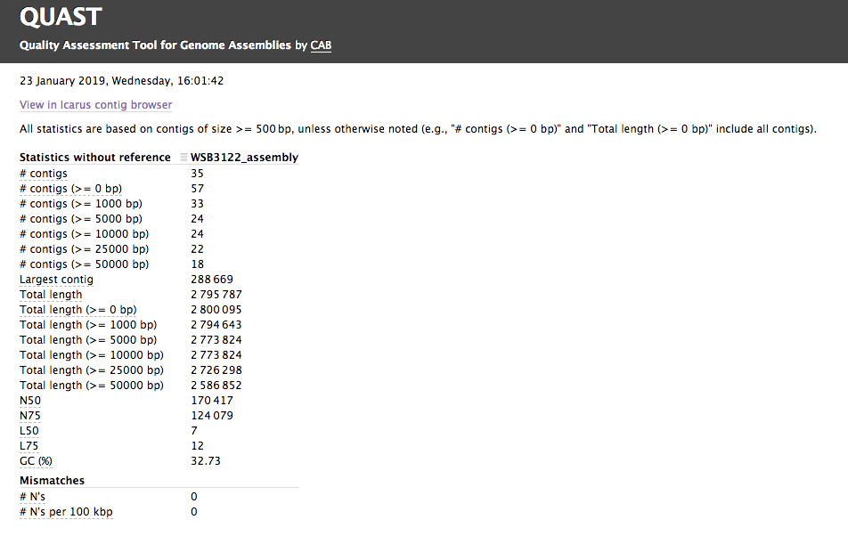

# nf-core/bacass: Output

This document describes the output produced by the pipeline. 

## Pipeline overview
The pipeline is built using [Nextflow](https://www.nextflow.io/)
and processes data using the following steps:

* [Quality trimming and QC](#quality-trimming-and-qc) of input reads
* [Taxonomic classification](#taxonomic-classification) of trimmed reads
* [Assembly](#assembly)  of trimmed reads
* [Assembly visualization](#assembly-visualization) 
* [Assembly QC](#assembly-qc) 
* [Annotation](#annotation) of the assembly 
* [Report](#report) describing results of (most of) the pipeline 

## Quality trimming and QC

This steps quality trims the end of reads, removes degenerate or too short reads and if needed,
combines reads coming from multiple sequencing runs. It also runs FastQC which produces
general quality metrics on your (trimmed) samples and plots them.

For further reading and documentation see the [FastQC help](http://www.bioinformatics.babraham.ac.uk/projects/fastqc/Help/).

**Output directory: `{sample}/{sample}_reads/`**

* `*.fastq.gz`
  * trimmed (and combined reads)
* `*_fastqc.html`
  * FastQC report, containing quality metrics for your trimmed reads
* `*_fastqc.zip`
  *  zip file containing the FastQC report, tab-delimited data file and plot images

### FastQC screenshot

## Taxonomic classification

This QC step classifies your reads using [Kraken2](https://ccb.jhu.edu/software/kraken2/) a k-mer based approach. This helps to identify samples that have purity
issues. Ideally you will not want to assemble reads from samples that are contaminated or contain
multiple species. If you like to visualize the report, try
[Pavian](https://github.com/fbreitwieser/pavian) or [Krakey](http://krakey.info/).

**Output directory: `{sample}/`**
* `*_kraken2.report`
  * Classification in the Kraken(1) report format. See
    [webpage](http://ccb.jhu.edu/software/kraken/MANUAL.html#sample-reports) for more details

### Kraken2 report screenshot

## Assembly

Trimmed reads are assembled with [Unicycler](https://github.com/rrwick/Unicycler).
Unicycler is a pipeline on its own, which at least for Illumina reads mainly acts as a frontend to 
Spades with added polishing steps.

**Output directory: `{sample}/`**
* `{sample}_assembly.fasta`
  * Final assembly
* `{sample}_assembly.gfa`
  * Final assembly in Graphical Fragment Assembly (GFA) format
* `{sample}_unicycler.log`
  * Log file summarizing steps and intermediate results on the Unicycler execution

## Assembly Visualization
The GFA file produced in the assembly step can be used to visualise the assembly graph, which is
done here with [Bandage](https://rrwick.github.io/Bandage/). We highly recommend to run the Bandage GUI 
for more versatile visualisation options (annotations etc).

**Output directory: `{sample}/`**
* `{sample}_assembly.png`
  * Bandage visualization of assembly

### Bandage Screenshot

## Assembly QC

The assembly QC is performed with [QUAST](http://quast.sourceforge.net/quast).
It reports multiple metrics including number of contigs, N50, lengths etc in form of an html report.
It further creates an HTML file with integrated contig viewer (Icarus).

**Output directory: `{sample}/{sample}_assembly_QC`**
* `icarus.html`
  * QUAST's contig browser as HTML
* `report.html`
  * QUAST assembly QC as HTML report

### Quast Screenshot

### Icarus Screenshot

## Annotation

The assembly is annotated with [Prokka](https://github.com/tseemann/prokka) which acts as frontend
for several annotation tools and includes rRNA and ORF predictions. See [its documentation](https://github.com/tseemann/prokka#output-files) for a full description of all output files.

**Output directory: `{sample}/{sample}_annotation`**

## Report

Some pipeline results are visualised by [MultiQC](http://multiqc.info), which is a visualisation tool that generates a single HTML report summarising all samples in your project. Further statistics are available in within the report data directory.

The pipeline has special steps which allow the software versions used to be reported in the MultiQC output for future traceability.

**Output directory: `results/multiqc`**

* `Project_multiqc_report.html`
  * MultiQC report - a standalone HTML file that can be viewed in your web browser
* `Project_multiqc_data/`
  * Directory containing parsed statistics from the different tools used in the pipeline

For more information about how to use MultiQC reports, see http://multiqc.info

Please note that not all program output is captured by MultiQC.

**Output directory: `MultiQC/`**
